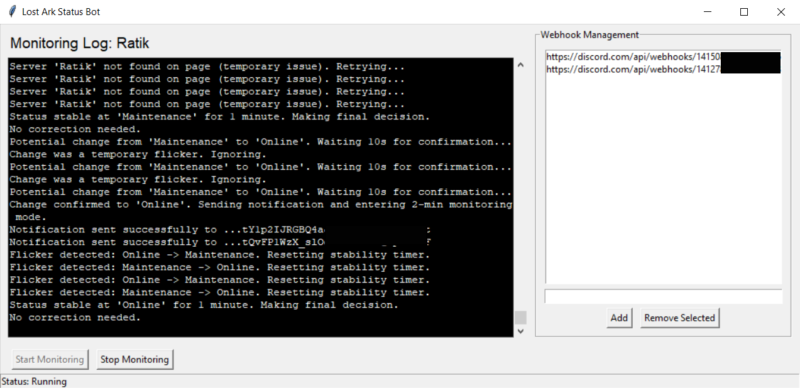
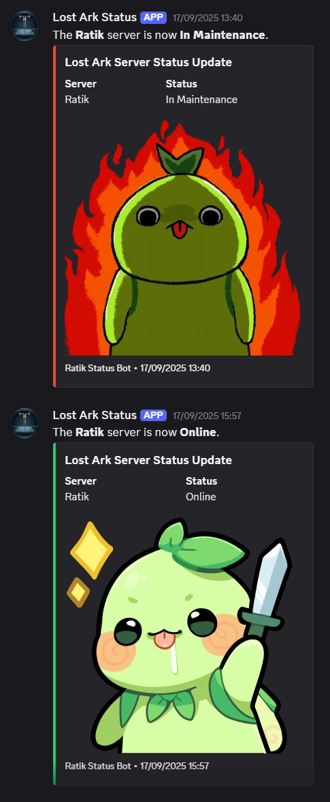

# Lost Ark Server Status Bot

Just sharing a bot to monitor the server status for the game Lost Ark and send notifications via Discord.
It was originally for personal use while servers are in Maintenance to know when they are back online without checking manually the website.

## Features

* Real-time monitoring of server status (Online, Busy, Full, Maintenance).
* Discord notifications with custom messages and images for each status.
* Advanced state machine logic to prevent false notifications from rapid status flickers.
* Graphical User Interface (GUI) to manage Discord webhooks.
* System tray icon for background operation.

## Preview

Here is what the application and its notifications look like:

**Application GUI:**



**Discord Notifications:**



## Installation

1. **Clone the repository:**

    ```bash
    git clone https://github.com/BurN-30/LOA-Server-Status.git
    cd LOA-Server-Status
    ```

2. **Create a virtual environment (recommended):**

    ```bash
    python -m venv venv
    ```

3. **Activate the virtual environment:**
    * **On Windows:**

        ```bash
        .\venv\Scripts\activate
        ```

    * **On macOS/Linux:**

        ```bash
        source venv/bin/activate
        ```

4. **Install the dependencies:**

    ```bash
    pip install -r requirements.txt
    ```

## Usage

1. **Configure the application:**
    * Open the `config.json` file.
    * Replace the placeholder URL inside `"webhook_urls"` with your own Discord webhook URL. You can add multiple URLs if you want to send notifications to several channels.
    * Change the `"server_name"` value from `"Ratik"` to the server you want to monitor (e.g., `"Azena"`, `"Kadan"`, etc.).

    Here is an example of a configured `config.json` file:
        ```json
    {
        "webhook_urls": [
            "https://discord.com/api/webhooks/1234567890/ABCDEFG..."
        ],
        "server_name": "Azena"
    }
        ```

2. **Run the script:**
        ```bash
    python LOA_Server_Status.py
        ```

## Creating an Executable

To create a standalone `.exe` file, you can use PyInstaller.

1. **Install PyInstaller:**

    ```bash
    pip install pyinstaller
    ```

2. **Create the executable:**

    ```bash
    pyinstaller --onefile --windowed --icon=icon.ico LOA_Server_Status.py
    ```

    * `--onefile`: Bundles everything into a single executable file.
    * `--windowed`: Prevents the console window from appearing when the app runs.
    * `--icon=icon.ico`: (Optional) Sets a custom icon for your executable. Make sure you have an `icon.ico` file in the same directory.

    The executable will be located in the `dist` folder.

## Important Files

* `LOA_Server_Status.py`: The main bot script.
* `config.json`: Configuration file for webhook URLs.
* `requirements.txt`: A list of the required Python dependencies.
* `icon.png`: The icon used for the system tray.
